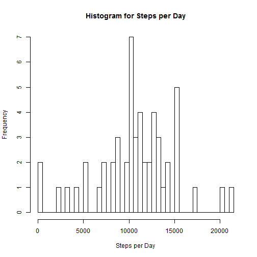
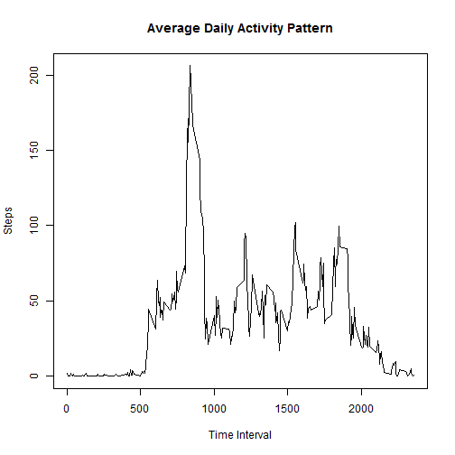
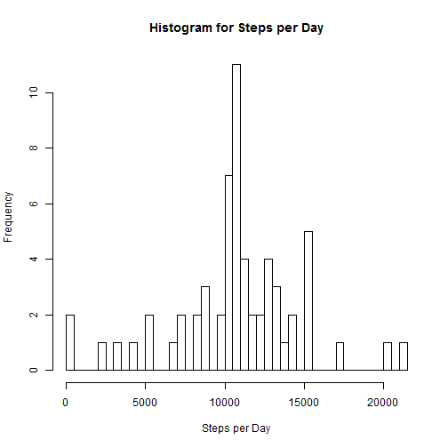

# Reproducible Research Assignment 1

## Loading and preprocessing the data


```r
setwd("D:/temp/Course/Reproducible research/data")
mydata <- read.csv("activity.csv")
str(mydata)
```

```
## 'data.frame':	17568 obs. of  3 variables:
##  $ steps   : int  NA NA NA NA NA NA NA NA NA NA ...
##  $ date    : Factor w/ 61 levels "2012-10-01","2012-10-02",..: 1 1 1 1 1 1 1 1 1 1 ...
##  $ interval: int  0 5 10 15 20 25 30 35 40 45 ...
```

```r
mydata$date <- as.Date(mydata$date) # correct date format
```

## What is mean total number of steps taken per day?
1) calculate total number of steps taken per day
2) Plot historgram of the total number of steps  taken each day

```r
tsteps <- aggregate(steps ~ date, mydata, na.rm = TRUE, sum)
hist(tsteps$steps, breaks = 50, main = "Histogram for Steps per Day", xlab = "Steps per Day", plot = TRUE)
```



3) calculate and report the mean and median of the total number of steps taken per day

```r
message(sprintf("Mean = "), round(mean(tsteps$steps), digits = 2))
```

```
## Mean = 10766.19
```

```r
message(sprintf("Median = "), round(median(tsteps$steps), digits = 2))
```

```
## Median = 10765
```
## What is the average daily activity pattern?
1) Make a time series plot(i.e. type = "l") of the 5-minute interval (x-axis) and the average number of steps taken, averaged across all days (y-axis)


```r
msteps <- aggregate(steps ~ interval, mydata, mean)
plot(msteps$interval,msteps$steps, type = "l", main = "Average Daily Activity Pattern", xlab = "Time Interval", ylab = "Steps")
```



2) Which 5-minute interval,  on average across all the days in the dataset, contains the maximum number of steps?

```r
msteps[which.max(msteps$steps),]
```

```
##     interval    steps
## 104      835 206.1698
```

## Imputing missing values
1) Calculate and report the total number of missing values in the dataset (i.e. the total number of rows with NAs)

```r
message(sprintf("Total number of missing values in the dataset = "), sum(is.na(mydata)))
```

```
## Total number of missing values in the dataset = 2304
```
2) Devise a strategy for filling in all of the missing values in the dataset. The strategy does not need to be sophisticated. For example, you could use the mean/median for that day, or the mean for that 5-minute interval, etc.

3) Create a new dataset that is equal to the original dataset but with the missing data filled in.

```r
## replace NA with average value of that interval
imputsteps <- mydata
for(i in 1:nrow(imputsteps)) {
  if(is.na(imputsteps[i, ]$steps)) {
    imputsteps[i, ]$steps <- msteps[msteps$interval == imputsteps[i, ]$interval, ]$steps
  }
}
```
4) Make a histogram of the total number of steps taken each day and Calculate and report the mean and median total number of steps taken per day. Do these values differ from the estimates from the first part of the assignment? What is the impact of imputing missing data on the estimates of the total daily number of steps?


```r
timputesteps <- aggregate(steps ~ date, imputsteps, sum)
hist(timputesteps$steps, breaks = 50, main = "Histogram for Steps per Day", xlab = "Steps per Day", plot = TRUE)
```



```r
message(sprintf("Mean total number of steps after impute = "), round(mean(timputesteps$steps), digits = 2))
```

```
## Mean total number of steps after impute = 10766.19
```

```r
message(sprintf("Median total number of steps after impute = "), round(median(timputesteps$steps), digits = 2))
```

```
## Median total number of steps after impute = 10766.19
```

```r
message(sprintf("Mean difference before and after impute = "), round(mean(tsteps$steps) - mean(timputesteps$steps), digits = 2))
```

```
## Mean difference before and after impute = 0
```

```r
message(sprintf("Median difference before and after impute = "), round(median(tsteps$steps) - median(timputesteps$steps), digits = 2))
```

```
## Median difference before and after impute = -1.19
```

##Are there differences in activity patterns between weekdays and weekends?
1) Create a new factor variable in the dataset with two levels - "weekday" and "weekend" indicating whether a given date is a weekday or weekend day.


```r
mydata$wd <- ifelse(weekdays(mydata$date) %in% c("Saturday", "Sunday"), "weekend", "weekday")
```

2) Make a panel plot containing a time series plot (i.e. type = "l") of the 5-minute interval (x-axis) and the average number of steps taken, averaged across all weekday days or weekend days (y-axis). See the README file in the GitHub repository to see an example of what this plot should look like using simulated data.


```r
library(lattice)
cwdwe <- aggregate(steps ~ interval + wd, mydata, mean)
xyplot(steps ~ interval | factor(wd), data = cwdwe, type = "l", layout = c(1,2), xlab = "Interval", ylab = "Number of Steps")
```


